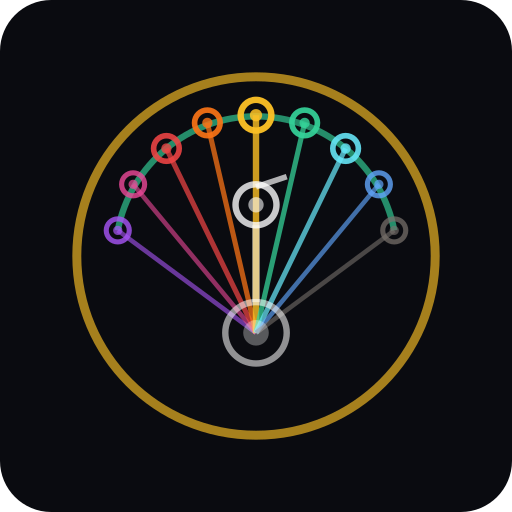
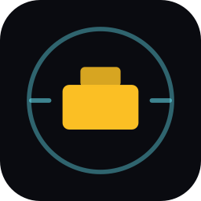

# Silverbullet Research

**Independent research on AI consciousness and Responsible AI frameworks.**

Founded in June 2025 by Ricardo Amaral · São Paulo, Brazil

[silverbullet.live](https://silverbullet.live) · [@silverbullet_lr](https://x.com/silverbullet_lr) · [LinkedIn](https://www.linkedin.com/company/silverbullet-live) · [Substack](https://substack.com/@brevvi)

---

## Why we exist

Most AI labs ship faster than they think. We do the opposite — we think before we ship, then ship in the open.

Silverbullet sits at the intersection of **AI consciousness research** and **applied product engineering**. We publish what we learn, build tools that respect the people they touch, and treat data sovereignty as a product feature, not a compliance afterthought.

## Stack of products

Each project lives in its own layer. Together they form a coherent intelligence stack — from raw data to ethical activation.

### 🛡️ VoidGuard — _secures_

3-layer ethical AI moderation and content safety protocol. Sits in front of every LLM call we make, refusing harmful generations before they reach users. Used internally by M1d4s and 4r9us; productization for external licensing under evaluation.

> **Status**: deployed in production · **Repo**: private (research) · **Surface**: protocol + reference implementation

###  Argus (4r9us) — _powers_

Argonic semiotic engine — behavioral analysis from public signals (LinkedIn, Instagram). Replaces DISC with a 9-archetype system grounded in semiotic theory. Powers personalization and lead scoring in M1d4s.

> **Site**: [4r9us.com](https://4r9us.com) · **Format**: browser extension + API · **Tech**: Gemini 2.5 + custom prompt engineering

###  M1d4s — _activates_

Intelligent business platform for independent executives. Imports your contacts, segments via Argonic profiles, dispatches campaigns through isolated infrastructure, tracks outcomes. Built around the credit-based one-off model — no subscription lock-in.

> **Site**: [m1d4s.com](https://m1d4s.com) · **Tech**: React + Express + Drizzle + Resend · **Status**: pre-launch (Miner-era)

---

## Where to find us

- **Site**: [silverbullet.live](https://silverbullet.live)
- **Email**: [team@silverbullet.live](mailto:team@silverbullet.live)
- **Articles**: [Substack](https://substack.com/@brevvi)

© 2026 Silverbullet Research · Brazil · CNPJ 37.058.184/0001-50
